

  
  <h1> KB4YG </h1> 

Oak Creek Valley is a region near the city of Corvallis filled with areas for hiking and recreation.
Recreation areas in Oak Creek Valley include the McDonald-Dunn Forest, Cardwell Hill, Fitton Green,
Bald Hill Farm, and more. These natural areas are enjoyed by many for hiking, mountain biking, and
other recreational activities. Our project, Know Before You Go (KB4YG), is an Internet of Things (IoT) 
and machine learning project with a mobile app that aims to help both landowners monitor land usage 
and park visitors determine how busy a recreation site is before they arrive. Providing the number 
of available parking spots helps alleviate traffic congestion at trailheads, saving visitors time 
and gas while preventing overuse of natural areas.

  
  
  
  

  <a href="https://kb4yg.org">Demo</a>
   · 
    <a href="https://github.com/KB4YG/frontend">Frontend</a>
   · 
    <a href="https://github.com/KB4YG/backend">Backend</a>
   · 
    <a href="https://github.com/KB4YG/ml">ML</a>
   · 
    <a href="https://github.com/KB4YG/iot">IoT</a>

# Table of Contents
1. [Introduction](#introduction)
2. [Running Locally](#running-locally)
3. [Folder Structure](#folder-structure)
4. [Application Flow](#application-flow)
5. [Implementation Details](#implementation-details)
6. [Deployment](#deployment)
7. [Future Development](#future-development)

## Introduction
The Know Before You Go (KB4YG) project was the product of eight students at Oregon State University 
during the 2021-2022 Senior Capstone course. These eight students were divided into three groups: 
IoT, Backend, and Frontend.

This repository stores the frontend code of the project. The KB4YG app is a cross-platform Flutter 
application available on Android, iOS, and the [web](https://kb4yg.org).

### Resources
A few resources to get you started if this is your first Flutter project:

- [Lab: Write your first Flutter app](https://flutter.dev/docs/get-started/codelab)
- [Cookbook: Useful Flutter samples](https://flutter.dev/docs/cookbook)
- [YouTube Playlist: Netninja's Flutter Tutorial for Beginners](https://www.youtube.com/playlist?list=PL4cUxeGkcC9jLYyp2Aoh6hcWuxFDX6PBJ)

For help getting started with Flutter, view the [online documentation](https://flutter.dev/docs), 
which offers tutorials, samples, guidance on mobile development, and a full API reference.

## Running Locally
1. Install Flutter: https://docs.flutter.dev/get-started/install
2. Set up IDE (Android Studio recommended): https://docs.flutter.dev/get-started/editor
3. Clone Repo: Run `git clone https://github.com/KB4YG/frontend` from terminal
4. Install Packages: Navigate to cloned folder and run `flutter pub get` from terminal
5. Run: Open cloned folder in editor and run with Chrome (or other browser), physical Android phone, 
   or device emulator (see https://docs.flutter.dev/get-started/test-drive)

## Folder Structure
One of the most confusing aspects of Flutter (initially, at least) for us was the folder structure.
This section attempts to demystify this default structure while also explaining our additions. For 
reference, our folder structure was informed by [this style guide](https://www.geeksforgeeks.org/flutter-file-structure/).

By default, Flutter created three main folders in the root directory: lib, android, ios, and web.
The latter three folders contain files specific to their respective platforms. Very few files in these
directories were manually added or modified by us, so a newcomer hoping to familiarize themself with
our codebase might best ignore them for now. The following image and list describes the purpose of every 
notable folder in the project:

  

- `.github`: Workflows associated with this repository (see [How to Deploy Website](#deployment)).
- `android`: Android specific files.
- `assets`: Static assets (fonts, home screen images, logo, etc.).
- `doc`: Documentation files (e.g., the images within this README).
- `ios`: iOS specific files.
- `lib`: Library of widgets, classes, and functions that make up the KB4YG application.
- `web`: Web specific files.
- `lib/extensions`: Helper functions for pre-existing classes (e.g., `String.Capitalize()`). 
- `lib/models`: Classes that modularize and help interact with data from the backend.
- `lib/providers`: Singletons used throughout the application, typically to interact with external APIs.
- `lib/screens`: Primary views of the user interface of the app.
- `lib/utilities`: Functions or logic used in the app.
- `lib/widgets`: Widgets (discrete "object" on screen) / layouts.

## Application Flow

 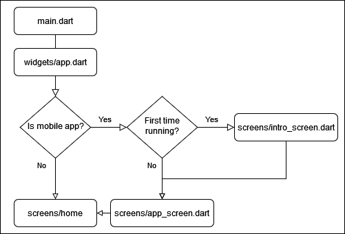 

First, we enter [main()](lib/main.dart) in `main.dart`, where the code initializes and runs the 
[App()](lib/widgets/app.dart) widget, which checks whether it is the user's first time running the app 
and on what platform.

If not on the web (i.e., using the mobile app) and the user hasn't opened the app before, the 
[IntroScreen()](lib/screens/intro_screen.dart) is displayed and guides the user through the various screens within the app. 
Afterwards (or if the user has opened the application before), the [AppScreen()](lib/screens/app_screen.dart) 
is built and displayed.

After the above occurs on the mobile app or if the user is accessing the website, the [HomeScreen()](lib/screens/home) 
introduces the application, at which point the user is able to navigate to any of the main screens as 
shown below.

 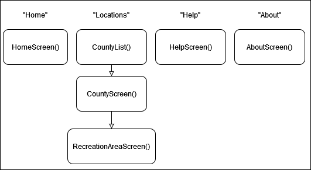 

The text boxes at the top of each column show the page name displayed to the user (i.e., what they
click/tap on) while each rounded rectangle represents a particular screen.

On the web, the user clicks on one of the items in the [Navbar()](lib/widgets/navbar.dart) (or in 
the [NavigationDrawer()](lib/widgets/navigation_drawer.dart) on a phone) to navigate to a particular page. 
On mobile, the user taps on one of the bottom tabs of the [CustomTabBar()](lib/widgets/custom_tab_bar.dart).

See the [Screens](#screens) for details regarding each screen.

## Implementation Details

### Models
The frontend was tasked with displaying parking spot counts and fire danger information for each 
location our application supports. To handle this data, we created four models, all of which are
stored in the [lib/models](lib/models) directory.

For each model, an instance is constructed by parsing a JSON file sent from the backend (see 
[Backend Connection](#backend-connection)), which is requested based on the current screen (see 
[Routing / Navigation](#routing--navigation)).

The following sections describe notable design decisions for each model. (Observe that the first 
three models are listed below in ascending level of abstraction.)

#### 1. [ParkingLot()](lib/models/parking_lot.dart)
The base level unit of the project where we collect parking data. Contains the actual parking spot 
counts and [HATEOAS](https://en.wikipedia.org/wiki/HATEOAS) links to the related recreation area and
county screens. 

We used the convention where a negative parking spot value indicates either 1) an error or 2) no 
established parking spots of that type for the parking lot. For instance, Fitton Green has no designated
handicap parking, so the whole system (IoT->Backend->Frontend) will use some negative value (e.g., -1) 
to convey this difference between all-in-use and never-available. Use the `spotStr` or `handicapStr` 
getters to access string variants of these parking counts (returns 'n/a' for negative counts).

Regarding naming motivation, we considered "AccessPoint" instead of "ParkingLot" but chose the latter
due to its increased specificity and relevancy towards the use case of the user. Note that a parking
lot may just be a gravel or dirt covered rather than cemented.

#### 2. [RecreationArea()](lib/models/recreation_area.dart)
A collection of parking lots that provide access to a natural area. Contains information relevant to 
the recreation area (e.g., name and description).

Note that the `spots` and`handicap` properties contain the totals for each parking lot that provides 
access to the recreation area. Likewise, `fireDanger` is the highest fire danger level and `dt` is 
the least recent timestamp amongst associated parking lots.

We chose "RecreationArea" over something like "NaturalArea" since it highlighted that a location may 
be more "domesticated" (e.g., a park rather than a hiking trail).

#### 3. [County()](lib/models/county.dart)
A collection of recreation areas within a county. Also contains info. relevant to the county, such as
name, latitude, and longitude.

Similar to a `RecreationArea()`, many of its properties aggregate or interpret values of its 
encapsulated data structures.

#### 4. [FireDanger()](lib/models/fire_danger.dart) 
The risk of fire ignition for a region as designated by the Oregon Department of Forestry (ODF).

One requirement of the frontend application was to inform recreationists about the likelihood of a 
fire igniting, which is a growing concern as the effects of climate change continue to worsen.

Toward that end, the `FireDanger()` class acts essentially as a glorified enum, wrapping a string that 
describes the fire danger level with information such as its associated color and the timestamp of its
designation (danger level can vary throughout the year).

See [ODF's website](https://www.oregon.gov/odf/fire/Pages/weather.aspx) for more information.

### Backend Connection
To source the data used by the four data models, we created the [BackendProvider()](lib/providers/backend.dart)
singleton as an interface for the Backend's API. 

This object is initialized in [main.dart](lib/main.dart) so it may be accessed throughout the widget 
tree thanks to the third-party [Provider](https://pub.dev/packages/provider) package. 

For instance, `final backend = Provider.of<BackendProvider>(context, listen: false);` (or `BackendProvider.of(context);` 
for brevity) retrieves the instance of `BackendProvider()` to call one of its fetch methods. Alternatively, 
one may evoke these functions without storing an instance of the singleton using, for example, 
`BackendProvider.of(context).getCountyList();`.

These fetch methods send an asynchronous GET request to the backend API at the `/locations` endpoint 
and parse the returned JSON object into the corresponding data model as described in the 
[Models](#models) section.

Each screen that uses information from the backend wraps the screens content in a [FutureBuilder](https://api.flutter.dev/flutter/widgets/FutureBuilder-class.html).
The `future` property of the `FutureBuilder()` is set to the value returned by the fetch functions of 
`BackendProvider()` (e.g., `Future<List<String>> x = BackendProvider.of(context).getCountyList();` 
where `x` is the value passed as the builder's `future` argument). This approach allows one to handle 
exceptions by checking the `hasError` property of the snapshot.

Details regarding the backend implementation can be found at <https://github.com/KB4YG/backend>. 

### Screens
While the [Application Flow](#application-flow) section outlines the high-level interactions between 
the screens of the application, this section explains our implementation in more detail.

Each screen is located within the [lib/screens](lib/screens) directory, but some screens are in a 
nested folder depending on whether widgets on the screen were modularized into separate files.

#### 1. [HomeScreen()](lib/screens/home/home_screen.dart)

 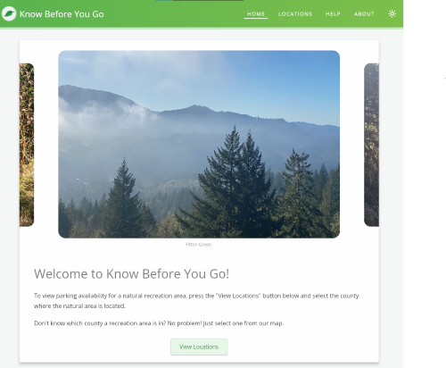 

The default landing screen of the app. Displays a welcome message and static images of select 
recreation areas within Oak Creek Valley (which are stored in [assets/images](assets/images)).

The web version of this screen has a "View Locations" button while the mobile app does not due to 
there not being a shared `Beamer()` ancestor between them in the latter. See [Areas for Improvement](#areas-for-improvement) 
for more details regarding this limitation.

#### 2. [HelpScreen()](lib/screens/help_screen.dart)

 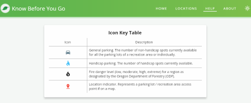 

Displays an icon key table that describes the meaning of icons used throughout the app.

#### 3. [AboutScreen()](lib/screens/about_screen.dart)

 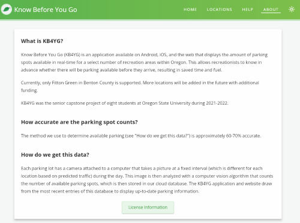 

Describes the application and answers potential questions of the user.

#### 4. [CountyListScreen()](lib/screens/county_list/county_list_screen.dart)

 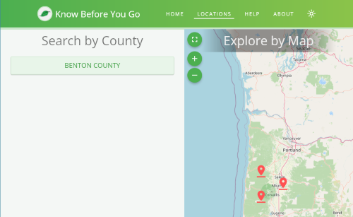 

Provides a list of supported counties for the user to choose from. Selecting one of these counties 
redirects the user to the associated `CountyScreen()`. A search filter is dynamically added to the list 
if there are three or more counties.

If the screen width is large enough, then the screen also displays a map of all monitored parking 
lots. Selecting one of these pins and pressing the popup card redirects the user to the associated 
`RecreationAreaScreen`.

#### 5. [CountyScreen()](lib/screens/county/county_screen.dart)

 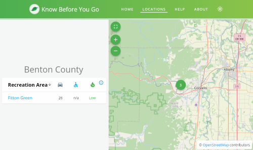 

Displays details for the specified county in a table and, if the screen is wide enough, a map with 
all parking lots within the scope of the county. Related to the [County model](#models).

Pressing a row in the table or the popup card in the map redirects the user to the `RecreationAreaScreen`.

#### 6. [RecreationAreaScreen()](lib/screens/recreation_area/recreation_area_screen.dart)

 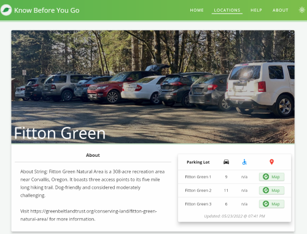 

Displays details for the specified recreation area, such as available parking, a description, and images. 
Related to the [RecreationArea model](#models).

Pressing the "Map" button in the column with a pin launches either 1) Google Maps (if on the web) 
or 2) a navigation app on the user's mobile device (if on mobile and one is available). This functionality 
is accomplished using the [Maps Launcher](https://pub.dev/packages/maps_launcher) package.

#### 7. [NotFoundScreen()](lib/screens/not_found_screen.dart)

 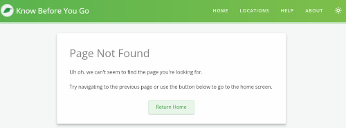 

Displays a 404 error for requested pages that do not exist. Web only.

#### 8. [IntroScreen()](lib/screens/intro_screen.dart)

 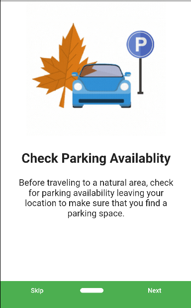 

Highlights the main features of the app on the user first launch. Mobile only.

#### 9. [AppScreen()](lib/screens/app_screen.dart)

Wraps the application in a scaffold widget that displays tabs for the various screens. Mobile only.

### Routing / Navigation
Flutter has two native approaches to handling navigation between screens: the simple [Navigator class](https://api.flutter.dev/flutter/widgets/Navigator-class.html), 
which does not handle when a user goes to specific URL on the web (e.g., "kb4yg.org/locations/benton/fitton-green"), 
and the [Router class](https://api.flutter.dev/flutter/widgets/Router-class.html), which can be 
customized to our advanced needs but is cumbersome and tedious to work with.

Due to these in-ideal options, the KB4YG app uses the third-party package [Beamer](https://pub.dev/packages/beamer) 
for its routing needs. 

On the web, this allows us to handle whatever URL the user enters with ease. On mobile, Beamer helps 
save nested navigation. For instance, if you were in the "Locations" tab and selected a recreation 
area, navigated to the `HomeScreen()`, and tapped on the "Locations" tab again, then you would return 
to where you left off; without saving nested navigation you would see the `CountyListScreen()` instead.

Read the [API documentation for Beamer](https://pub.dev/packages/beamer) to understand how it works. 
In effect, navigation is performed by calling `Beamer.of(context).beamToNamed({routeName});`. Valid 
routes are specified by the `BeamerDelegate()` that is passed as the `routerDelegate` argument of a 
`Beamer()` when it is first initialized. 

On mobile, navigation is implemented with multiple `Beamer()`s and `BeamerDelegate()`s in the [AppScreen()](lib/screens/app_screen.dart). 
We used multiple `Beamer()` `BeamerDelegate()` pairs so that the user's nested navigation is not lost when
cycling between tabs.

On the web, routing is implemented with a single `Beamer()` in the [App widget](lib/widgets/app.dart) 
since we don't have tabs and thus do not need to save nested navigation.

A `BeamerDelegate()` requires a location builder to be specified. Location builders take in a list of 
beam locations. Each `BeamLocation()` extended class requires the patterns it is to be matched with as 
well as a build function that returns the `BeamPage()` to build. In our implementation, beam locations 
for each screen are implemented in [lib/utilities/beam_locations.dart](lib/utilities/beam_locations.dart)
and `BeamPage()`s are declared within each screen object (except for screens within the "Locations" tab).

Route names and pattern-matching formats are located in [lib/constants.dart](lib/constants.dart).

### Theme
We allow the user to toggle between light-mode and dark-mode. Theming is implemented with the 
[ThemeProvider](lib/providers/theme.dart) class, which extends [ChangeNotifier](https://api.flutter.dev/flutter/foundation/ChangeNotifier-class.html).
`ThemeProvider()` is instantiated in [main.dart](lib/main.dart), and thus may be accessed throughout 
the widget tree using `Provider.of<ThemeProvider>(context);`. 

In the [App widget](lib/widgets/app.dart), we use the above command to add a listener that rebuilds 
the widget tree when the field `themeMode` in `ThemeProvider()` changes. The function `toggleTheme()` 
of `ThemeProvider()` toggles this field and is triggered by the [theme_switch](lib/widgets/theme_switch.dart) 
widget (mobile) or the [theme_icon_button](lib/widgets/theme_icon_button.dart) widget (web).

### Testing
We created a file ([benton_county.dart](lib/benton_county.dart)) to model how data is stored in the 
backend. So on any screen that queries the backend for information (`CountyListScreen()`, `CountyScreen()`, 
`RecreationAreaScreen()`), one may replace the backend context accessor (`BackendProvider.of(context).getCounty(widget.countyUrl);`)
with a future constructor that uses the test file (`Future<County>.value(County.fromJson(bentonCountyJson));`).
This way one can more easily test and modify location data without affecting information in the database.

## Deployment

### How to Deploy Website

Pushing to or merging the master branch triggers a GitHub action that automatically deploys the site 
with Firebase. IMPORTANT: this means that any merge or push to master will rebuild the website, so 
the master branch is tied with production. Note that a failed build will leave the site unchanged 
and Firebase allows you to rollback to previous site versions.

(See https://www.youtube.com/watch?v=xJo7Mqse960 and the related 
[repo](https://github.com/JohannesMilke/flutter_firebase_hosting/blob/master/.github/workflows/main.yml) 
for more information on GitHub flows.)

We chose Firebase since it was easy to both setup a Flutter application and purchase a domain from 
Google Domains. Using the [Firebase console](https://console.firebase.google.com), one is able to 
rollback the site to previous versions, handle domains, and monitor usage. 

 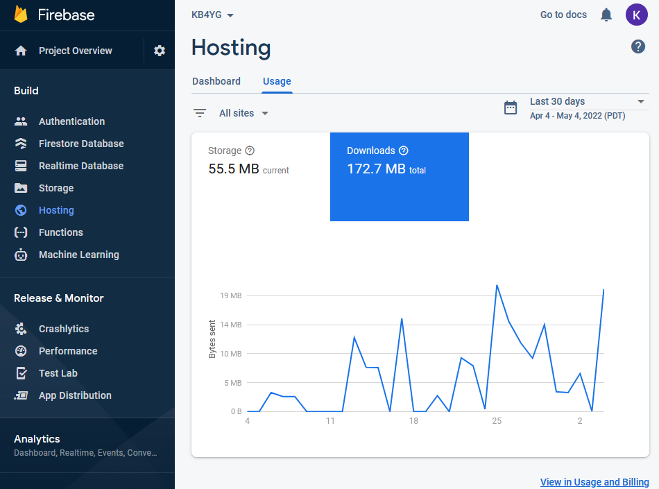 

NOTE: Firebase (free tier) has a 10 GB storage limit (which shouldn't be an issue since you can just 
delete old versions of the site) and a 10 GB download limit. Given that each page might cause the 
user to download around 13 KB (according to [this site](https://sitechecker.pro/page-size/)) we don't 
expect this limit to be an issue with the current popularity of our project, but this could change as
KB4YG grows in popularity.

### How to Deploy Mobile App
Here are some resources that provide a step by step process on how to publish or update Flutter  
applications on mobile:
- [Flutter Docs: Android Deployment](https://docs.flutter.dev/deployment/android)
- [Flutter Docs: iOS Deployment](https://docs.flutter.dev/deployment/ios)
- [Youtube: How To Publish Flutter App On Play Store](https://www.youtube.com/watch?v=g0GNuoCOtaQ&ab_channel=JohannesMilke)
- [Youtube: Build and Release Flutter App to App Store](https://www.youtube.com/watch?v=akFF1uJWZck&ab_channel=MJSDCoding)

## Future Development

### Known Bugs

- Gestures seem to be disabled / don't work correctly on phones with Firefox (Chrome works great though). 
  We suspect this may just be a limitation of Flutter on non-chromium based browsers.
- Refreshing the [ParkingLot()](lib/models/parking_lot.dart)s of a [ParkingMap()](lib/widgets/maps/parking_map.dart)
  updates the spot counts but will cause errors if the number of locations shrinks. I.e., a given pin
  will not disappear even if one calls `setState()` to update the parking lots in a `ParkingMap()`'s 
  parent widget. Tapping on this defunct card on the map will cause an exception due to the underlying
  data no longer existing. We prioritized our time elsewhere as the likelihood of the number of parking
  lots reducing between reloads is low/non-existent. Stated differently, while the spot counts may 
  change, there would be no reason (save for some backend error) why a given parking lot would cease
  to be in the database. One potential solution would be to attach a `ChangeNotifier()` or some other
  listener as a parent to a `ParkingMap()`.

### Areas for Improvement

- Currently, the web application has a "View Locations" button while the mobile app does not. This is 
  due to being unable to navigate between different `BeamerDelegate()`s multiple times. Specifically, 
  the mobile app has a separate `BeamerDelegate()` for each tab (which is necessary for saving nested 
  navigation), so using `Beamer.of(context).beamToNamed({});` seems to check only the delegate of that 
  tab rather than the tab we want to navigate to. We were unable to figure out a work-around due to 
  time constraints and its low urgency.
- Recreationists may want to know the temperature / weather of a location, so it may be worth 
  incorporating an external API like the OpenWeatherAPI.
- The about section for a given recreation area is retrieved from the backend. These paragraphs 
  sometimes contain web addresses, but we are unable to display them as links easily. Maybe create a 
  parser that creates the necessary `TextSpan()` links from the related field in the 
  `RecreationArea()` model, making the addresses clickable.
- One downside of Flutter for the web is poor SEO (search engine optimization). Hopefully, the 
  Flutter development team will improve SEO in a future update. But in the interim, one  may be able 
  to create a normal, static HTML page that users will first visit before starting up the actual 
  application, or just add meta tags to index.html. [PageSpeed Insights](https://pagespeed.web.dev/report?url=kb4yg.org) 
  can evaluate a website's performance and [this blog post](https://cinnamon.agency/blog/post/flutter_and_seo) 
  describes the SEO problem in more detail.
